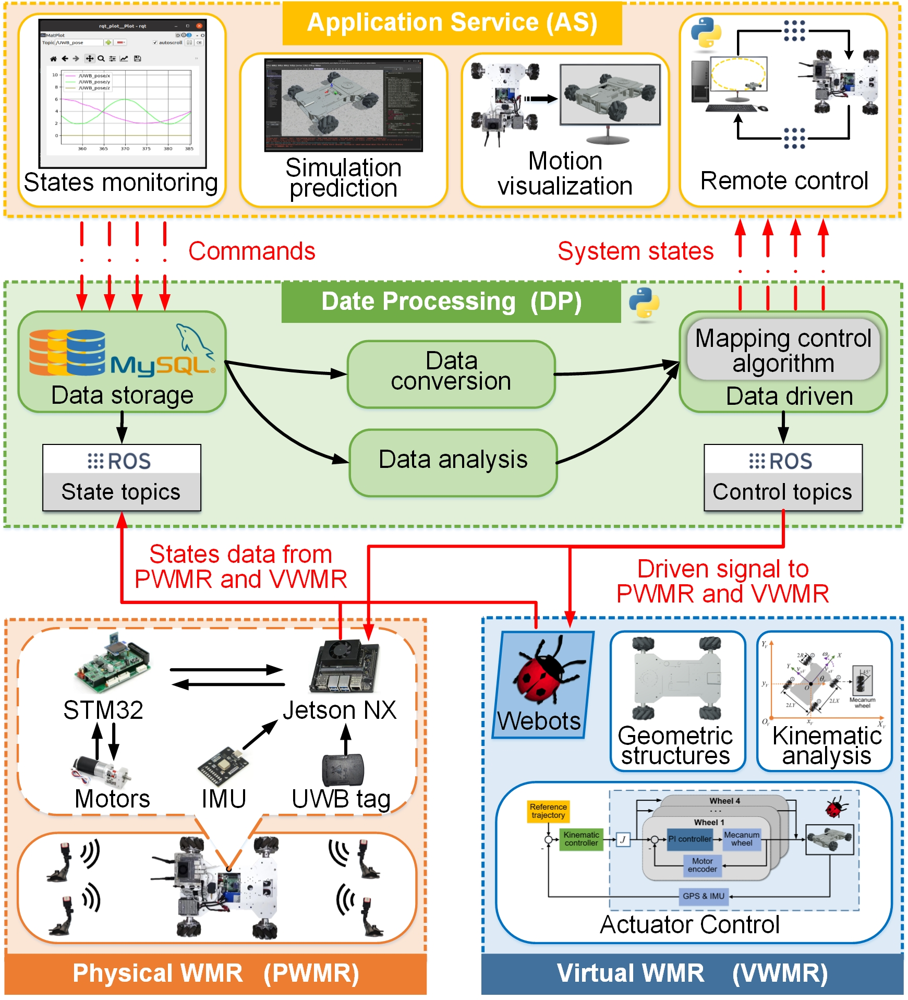

# digital_twin_project3
数字孪生赋能下全向移动机器人的三维可视化监控，远程操控和自主导航。ROS代码保存。

## 介绍
 **科研项目** ：数字孪生技术在移动机器人领域的应用探索

 **项目角色** ： 个人研究课题，总负责人

 **研究目标** ：开发一个基于移动机器人的数字孪生虚拟平台，并基于此虚拟平台实现对现实机器人的一系列智能管控，包括：3D可视化监控、远程控制、模拟仿真、自主导航和动态避障等。

 **研究过程** ：
1. 利用Blenders和Webots搭建麦克纳姆轮式机器人的三维虚拟数字孪生体，使用ROS控制；
1. C++和Python搭建上层控制节点，通过ROS控制虚实两个机器人；孪生数据保存至SQLite数据库；
1. 在上层控制节点设计虚实双边控制算法和自抗扰控制算法，实现虚实同步和以虚控实；
1. 在孪生环境中设计A*路径规划和DWA避障算法，利用Apriltag定位和虚实同步实现实体自主导航。

 **研究成果** ：实现数字孪生赋能移动机器人的智能监控、远程控制和自主导航，颠覆了传统机器人管控方式；同时输出科研论文4篇，其中3篇一区英文期刊在审，1篇专利已公开。

## 细节
#### 数字孪生仓库结构
四维数字孪生系统，包括物理WMR，虚拟WMR，数据处理和应用服务。

#### 数字孪生虚拟机器人建模

#### 虚实同步运动

